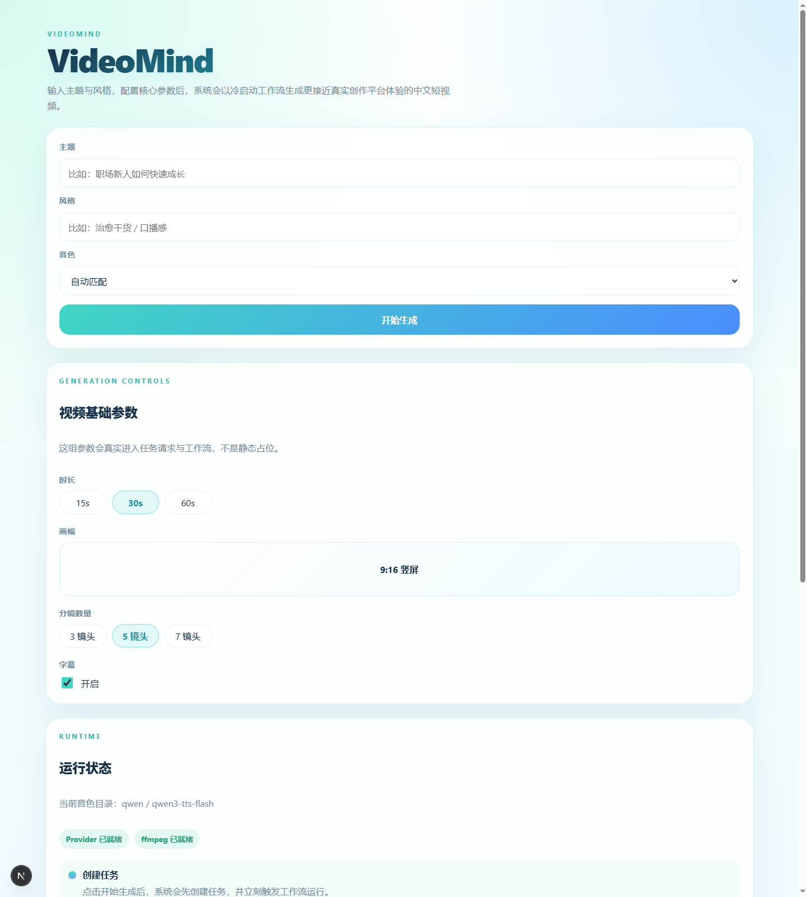

<h1 align="center">VideoMind</h1>

<p align="center"><strong>short_video</strong> · AI 中文短视频生成工作台</p>


`short_video` 是一个面向中文内容创作场景的 AI 短视频生成工作台。用户输入主题、风格、音色和基础参数后，系统会自动完成文案生成、分镜拆解、画面素材生成、配音合成和最终成片输出，目标是把“一个想法”快速变成可预览、可下载的竖屏短视频。

当前项目采用前后端分离架构：
- 前端使用 `Next.js` 构建生成工作台与任务详情页
- 后端使用 `FastAPI + LangGraph` 编排生成流程
- 模型能力当前以 `Qwen` 为主
- 最终媒体合成使用 `ffmpeg`

## 🖼️ 首页展示

当前首页工作台如下：



## ✨ 项目能力

- ✍️ 输入 `主题`、`风格`、`音色` 与基础视频参数
- 🧠 自动生成创意 brief、口播文案与分镜
- 🎨 为每个分镜生成图片素材
- 🎬 为每个分镜进一步生成视频片段
- 🗣️ 合成中文配音音频
- 📦 将视频片段、配音与字幕渲染为最终 `mp4`

## 🔄 短视频制作流程

项目当前的真实短视频制作流程如下：

1. 用户在首页输入主题、风格、音色、时长、分镜数量等参数。
2. 后端创建任务，并由 LangGraph 工作流启动 6 个核心阶段：
   `director -> script -> storyboard -> visual -> voice -> editor`
3. `director` 生成创意 brief，明确视频基调、叙事方向和镜头节奏。
4. `script` 生成完整中文口播文案。
5. `storyboard` 将文案拆分成多个分镜，确定每个镜头的画面描述与字幕内容。
6. `visual` 先为每个分镜生成图片，再进一步生成对应的视频片段。
7. `voice` 为整段文案生成中文配音音频。
8. `editor` 使用 `ffmpeg` 将视频片段、配音和字幕信息整合，输出最终成片。
9. 前端在首页或任务详情页中展示任务进度、素材、音频和最终视频。

## 📁 目录

- `frontend`: Next.js 前端，提供任务创建与结果查看页面
- `backend`: Python 后端，提供任务与工作流 API
- `scripts`: 本地开发与辅助脚本
- `docs`: 设计与规划文档

## 🎯 开发目标

目标是让用户输入主题和风格后，系统自动生成中文竖屏短视频。

## 🧰 本地开发前提

- Python 3.11+
- Node.js 20+
- `backend` 依赖已安装
- `frontend` 依赖已安装

## ⚙️ 后端本地开发

在仓库根目录执行：

```powershell
Set-Location .\backend
python -m uvicorn app.main:app --reload --host 127.0.0.1 --port 8001
```

后端健康检查地址：

```text
http://127.0.0.1:8001/health
```

后端测试命令：

```powershell
python -m pytest backend/tests
```

## 🖥️ 前端本地开发

前端默认访问 `http://127.0.0.1:8001`，也可以通过 `NEXT_PUBLIC_API_BASE_URL` 覆盖。

在仓库根目录执行：

```powershell
Set-Location .\frontend
$env:NEXT_PUBLIC_API_BASE_URL = "http://127.0.0.1:8001"
npm run dev -- --hostname 127.0.0.1 --port 3000
```

前端测试命令：

```powershell
Set-Location .\frontend
npm test
```

## 🚀 一键本地联调

仓库提供了最小联调脚本 [`scripts/dev.ps1`](D:\short_video\scripts\dev.ps1)：

```powershell
powershell -ExecutionPolicy Bypass -File .\scripts\dev.ps1
```

如果你想用更符合 Windows 使用习惯的启动方式，也可以直接运行：

```bat
.\scripts\start-dev.cmd
```

这个脚本会：

- 自动清理占用 `8001` 和 `3000` 的进程
- 在两个新 PowerShell 窗口分别启动后端 `uvicorn` 和前端 `next dev`
- 为前端自动设置 `NEXT_PUBLIC_API_BASE_URL=http://127.0.0.1:8001`

如需修改端口，可以传参：

```powershell
powershell -ExecutionPolicy Bypass -File .\scripts\dev.ps1 -BackendPort 8001 -FrontendPort 3001
```

## 🎞️ 真实出片准备

要走真实出片链路，当前项目至少需要满足这两项：

- 配好至少一组真实 provider 的密钥
- 安装 `ffmpeg`，或把 `FFMPEG_BINARY` 指向现有可执行文件

项目现在支持专门的后端配置文件：`backend/.env`。

你可以先从 [backend/.env.example](D:/short_video/backend/.env.example) 复制一份：

```powershell
Copy-Item .\backend\.env.example .\backend\.env
```

然后把真实值填进去。环境变量仍然有效，并且优先级高于 `backend/.env`。

默认情况下，图片、音频、视频等生成产物会保存到：

```text
D:\short_video\artifacts
```

当前默认推荐配置是 `Qwen + ffmpeg`。只想临时覆盖时，也可以继续用环境变量。PowerShell 示例：

```powershell
$env:DASHSCOPE_API_KEY = "sk-..."
$env:LLM_PROVIDER = "qwen"
$env:IMAGE_PROVIDER = "qwen"
$env:TTS_PROVIDER = "qwen"
$env:VIDEO_PROVIDER = "qwen"
$env:LLM_MODEL = "qwen-plus-latest"
$env:IMAGE_MODEL = "qwen-image-2.0"
$env:TTS_MODEL = "qwen3-tts-flash"
$env:VIDEO_MODEL = "wan2.6-i2v-flash"
$env:FFMPEG_BINARY = "ffmpeg"
```

如果你想把 LangGraph 工作流运行过程接到 LangSmith 里观测，再额外配置：

```powershell
$env:LANGSMITH_TRACING = "true"
$env:LANGSMITH_API_KEY = "lsv2-..."
$env:LANGSMITH_PROJECT = "short-video-dev"
# 可选：
# $env:LANGSMITH_ENDPOINT = "https://api.smith.langchain.com"
# $env:LANGSMITH_WORKSPACE_ID = "workspace-id"
```

这样每次视频生成任务在后端运行时，LangSmith 里都可以看到一条顶层 run，以及
`director -> script -> storyboard -> visual -> voice -> editor` 这 6 个节点的执行状态。

如果你已经启动了后端，可以直接检查运行时就绪度：

```powershell
Invoke-RestMethod http://127.0.0.1:8001/api/runtime/readiness
```

也可以使用仓库自带脚本做本地检查：

```powershell
powershell -ExecutionPolicy Bypass -File .\scripts\check-real-generation-readiness.ps1
```

当返回里这三个值都满足时，就可以继续做第一次真实出片验证：

- `providersConfigured = true`
- `ffmpegAvailable = true`
- `readyForRealGeneration = true`

一个最小验证流程是：

1. 启动后端 `uvicorn`
2. 启动前端或直接调用创建任务接口
3. `POST /api/jobs`
4. `POST /api/jobs/{jobId}/run`
5. `GET /api/jobs/{jobId}` 查看 `status`、`voiceAsset`、`finalVideo`

如果你想直接一键跑这条链路，可以使用：

```powershell
powershell -ExecutionPolicy Bypass -File .\scripts\run-qwen-smoke.ps1
```

这个脚本会：

- 先检查 `/api/runtime/readiness`
- 创建一个测试任务
- 调用 `/api/jobs/{jobId}/run`
- 轮询任务详情直到结束
- 输出 `jobId`、`status`、`voiceSelection`、`voiceAsset`、`finalVideo`

如果当前环境还没装好，后端会返回 `degraded`，这表示工作流已跑通，但真实成片依赖还未满足。

## ✅ 验收命令

按 Task 10 的本地验收方式，在仓库根目录执行：

```powershell
python -m pytest backend/tests
Set-Location .\frontend
npm test
```

如需把联调脚本本身也纳入验收，补充执行：

```powershell
$tokens = $null
$errors = $null
[void][System.Management.Automation.Language.Parser]::ParseFile('D:\short_video\scripts\dev.ps1', [ref]$tokens, [ref]$errors)
if ($errors.Count -gt 0) { exit 1 }
```
